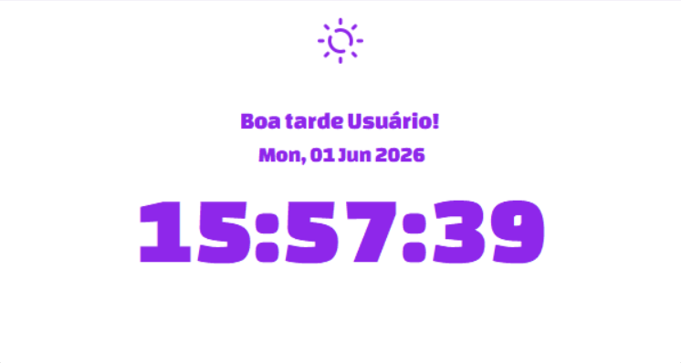
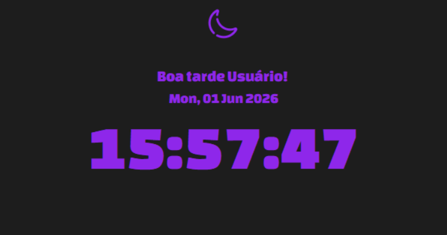

# THE CLOCK

<p>
    
    
    
</p>

Um aplicativo de relógio digital simples desenvolvido em Python utilizando a biblioteca Tkinter. Nele, é exibido uma saudação personalizada com o nome do usuário do sistema, a data atual e as horas em tempo real, contando também com a funcionalidade Dark e Light Mode.

## LAYOUT

### Light Mode:



### Dark Mode:


## BIBLIOTECAS

* **`tkinter`** Biblioteca padrão do Python para a criação de interfaces gráficas (GUI).

* **`os`:** Módulo que fornece uma maneira simples de usar funcionalidades dependentes do sistema operacional.

* **`time.strftime`:** Função que converte uma tupla de tempo (ou valor retornado por `localtime()`) em uma string de acordo com a formatação especificada (ex: extrair apenas as horas ou apenas a data atual).

* **`ctypes`:** Módulo usado para interagir com bibliotecas dinâmicas do Windows, permitindo carregar fontes externas diretamente da pasta do projeto para a memória volátil do aplicativo.

## EXECUÇÃO

1. Clone esse repositório:

```bash
git clone https://github.com/sahybr/the-clock.git
```

2. Certifique-se de que os arquivos de fontes e ícones estão dentro da pasta correta conforme o tópico de estrutura de pastas.

3. Execute o script:

```bash
python theclock.py
```
